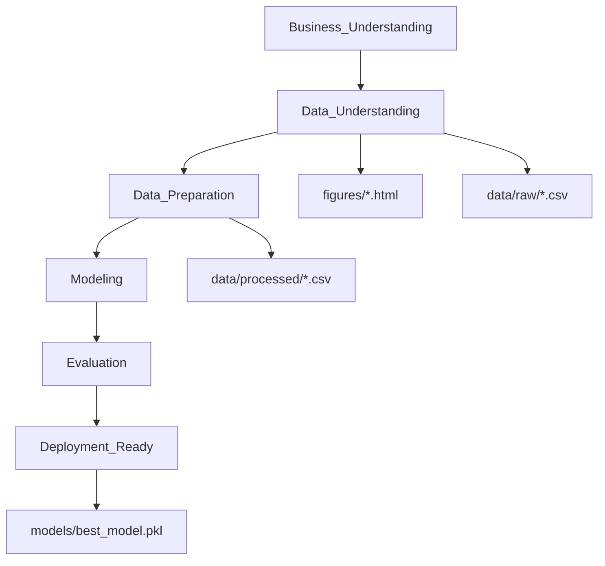

# Student Performance — Regression Project

Bu repo, `Student Performance` veri seti ile **CRISP-DM** metodolojisini takip eden uçtan uca bir regresyon projesidir. Tüm görseller **Plotly (interaktif)** üretilir ve `figures/` altına **HTML** olarak kaydedilir. Final model + tüm preprocessing adımları **joblib** ile `models/` altına `.pkl` olarak kaydedilir (Streamlit deployment için).

## Proje Akışı (CRISP-DM)




## Klasör Yapısı

```
apex/
├── data/
│   ├── raw/
│   └── processed/
├── figures/
├── models/
├── notebooks/
│   ├── student_performance_final.ipynb                       
└── README.md
```

## Kurulum

```bash
python -m venv .venv
source .venv/Scripts/activate
pip install -r requirements.txt // Direkt run ederek çalıştıradabilirsiniz.
```

## Çalıştırma

- Notebook (final): `notebooks/student_performance_final.ipynb`
- Notebook çalıştıkça şu çıktılar oluşur:
  - `data/raw/student_performance_raw.csv`
  - `data/processed/student_performance_clean.csv`
  - `data/processed/student_performance_features.csv`
  - `figures/*.html` (tüm Plotly grafikleri tek klasörde)
  - `models/best_model.pkl`

