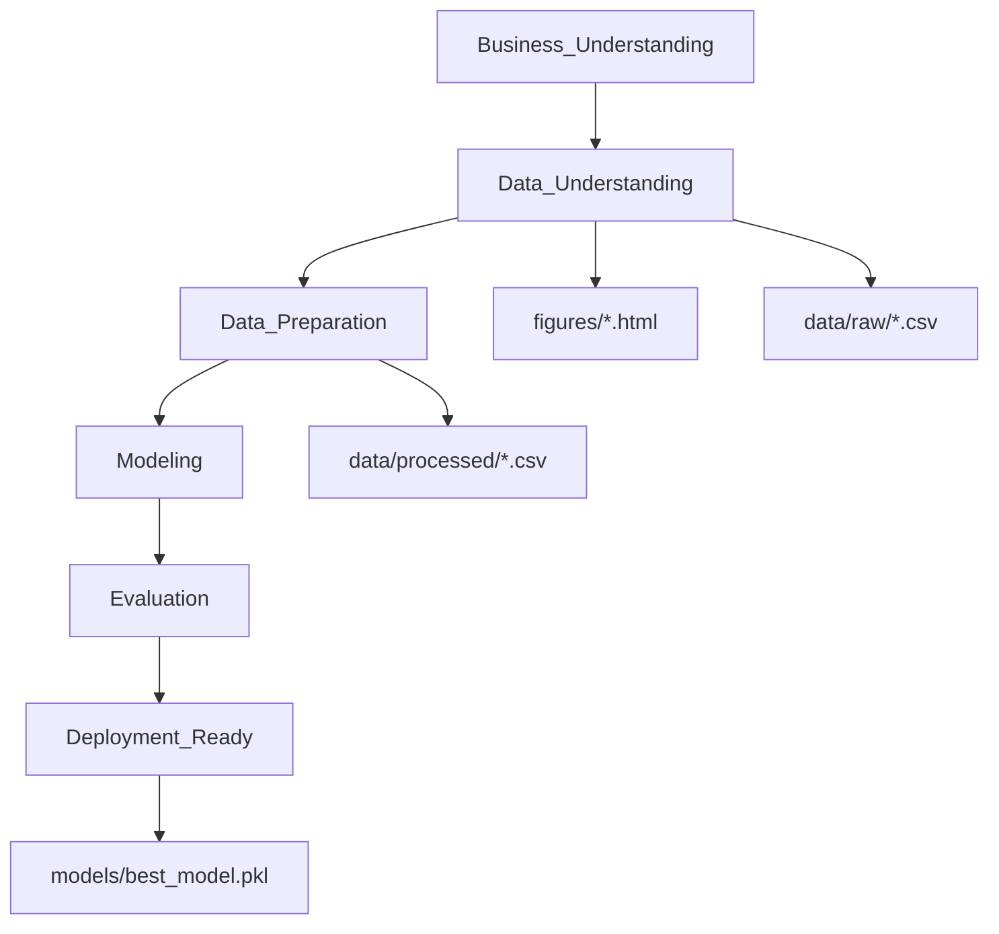

# Student Performance (CRISP-DM) — Plotly End-to-End Regression

Bu repo, `Student Performance` veri seti ile **CRISP-DM** metodolojisini takip eden uçtan uca bir regresyon projesidir. Tüm görseller **Plotly (interaktif)** üretilir ve `figures/` altına **HTML** olarak kaydedilir. Final model + tüm preprocessing adımları **joblib** ile `models/` altına `.pkl` olarak kaydedilir (Streamlit deployment için).

## Proje Akışı (CRISP-DM)



## Klasör Yapısı

```
apex/
├── data/
│   ├── raw/
│   └── processed/
├── docs/
│   └── anlatici_metin_sablonlari.md
├── figures/
├── models/
├── notebooks/
│   ├── student_performance_final.ipynb
│   ├── ikinci-versiyon.ipynb
│   └── ilk-yapilan.ipynb
├── tools/                        # Notebook hücrelerini otomatik güncelleyen scriptler
├── requirements.txt
└── README.md
```

## Kurulum

```bash
python -m venv .venv
source .venv/Scripts/activate
pip install -r requirements.txt
```

## Çalıştırma

- Notebook (final): `notebooks/student_performance_final.ipynb`
- Notebook çalıştıkça şu çıktılar oluşur:
  - `data/raw/student_performance_raw.csv`
  - `data/processed/student_performance_cleaned.csv`
  - `data/processed/student_performance_features.csv`
  - `figures/NN_*.html`
  - `models/best_model.pkl`

## Sonuçlar

Notebook içinde her adım **1 / 1.1 / 1.1.1** formatında ilerler ve her grafik için “neden var / ne gösteriyor / ne anlama geliyor / sonraki adım” yorumları eklenir.
